# CD-SBI Figure Gallery

_Auto-generated from `configs/figures/manifest.yaml` by `python -m cdsbi.analysis.figures.render --gallery`. Do not edit by hand._

## 8.1

### e1_loc_normal_calibration — §8.1 CDSBI 1-D calibration: marginal PIT + coverage curve

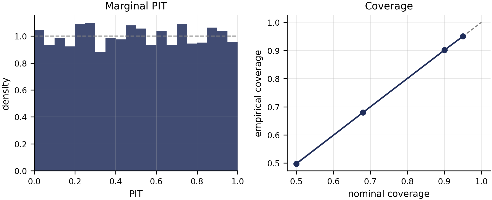

Source runs:
- `outputs/figure_data/8_1_cdsbi`

### e2_loc_normal_cross_method — §8.1 cross-method coverage curves (5 methods, medium budget)

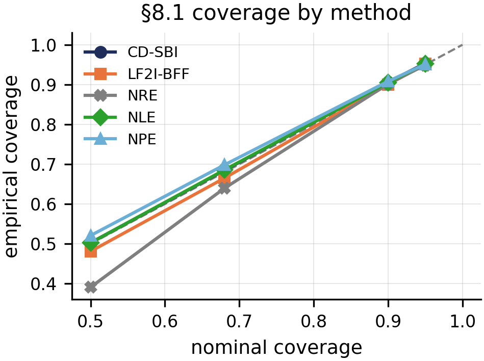

Source runs:
- `outputs/8_1_baseline_sweep/2026-05-27_00-57-31`

## 8.2

### e3_joint_diagnostics — §8.2 joint Mahalanobis PIT + coverage-error tile

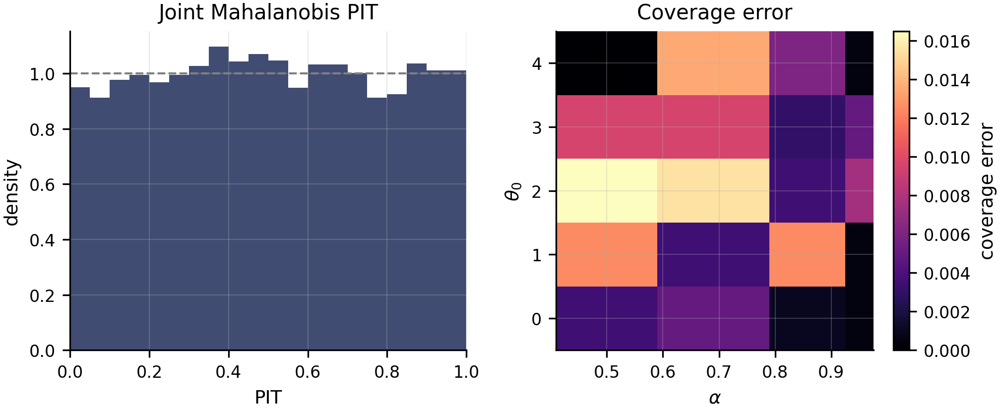

Source runs:
- `outputs/figure_data/8_2_cdsbi`

## 8.3

### e4_jacobian_recovery — §8.3 trained Jacobian vs L⁻¹ (KR uniqueness)

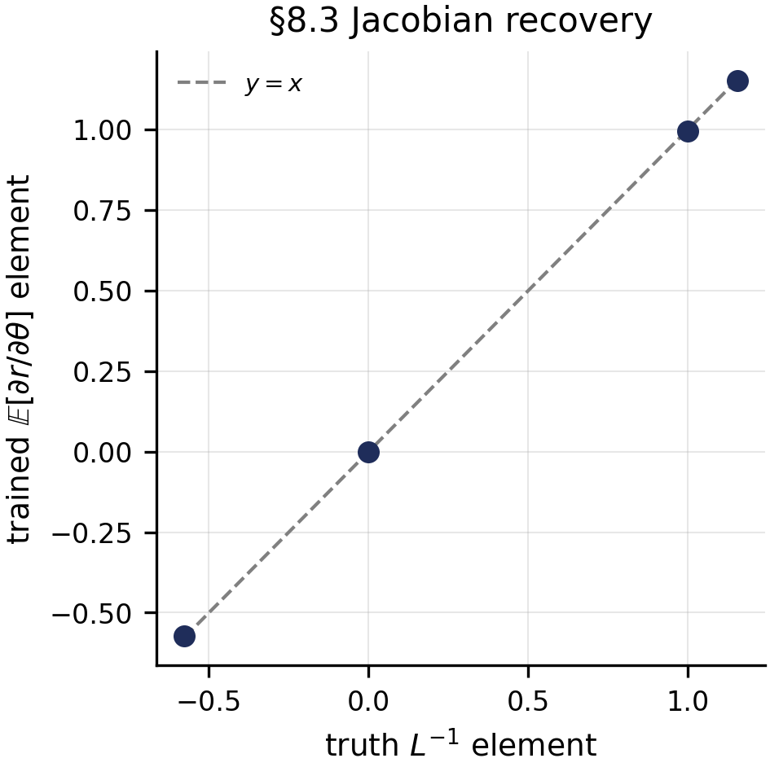

Source runs:
- `outputs/figure_data/8_3_cdsbi`

## 8.4

### e5_exp_rate_calibration — §8.4 doubly-monotone calibration: PIT + coverage + loss-vs-floor

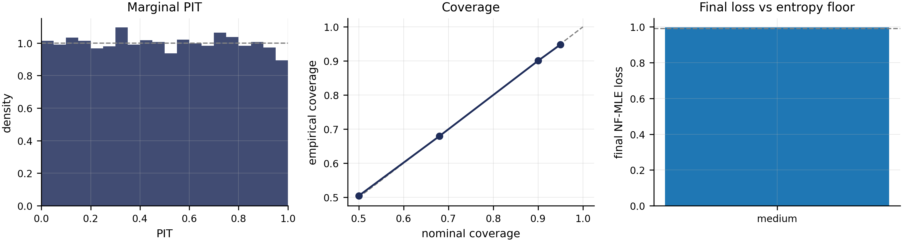

Source runs:
- `outputs/figure_data/8_4_cdsbi`

### e6_r2_ablation_bars — §8.4 (R2) ablation: R1+R2 vs R1-only tail-mean loss across budgets

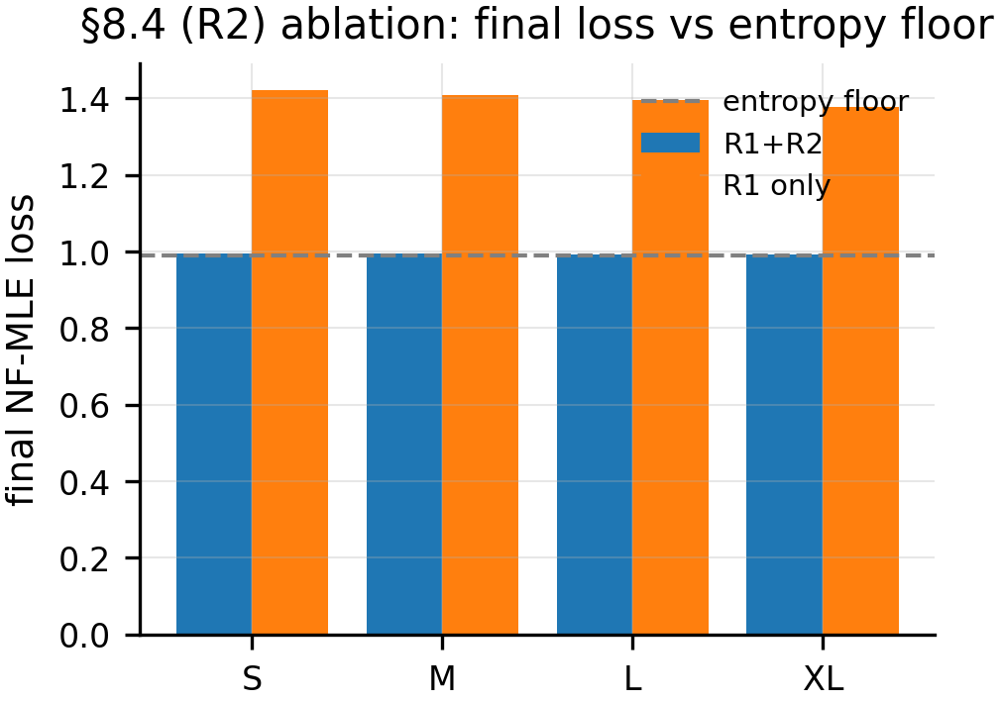

Source runs:
- `outputs/8_4_baseline_sweep/2026-05-27_20-20-16`
- `outputs/8_4_ablation/2026-05-27_23-55-59`

### e7_catastrophic_folding — §8.4 catastrophic folding: R1-only loss below the entropy floor

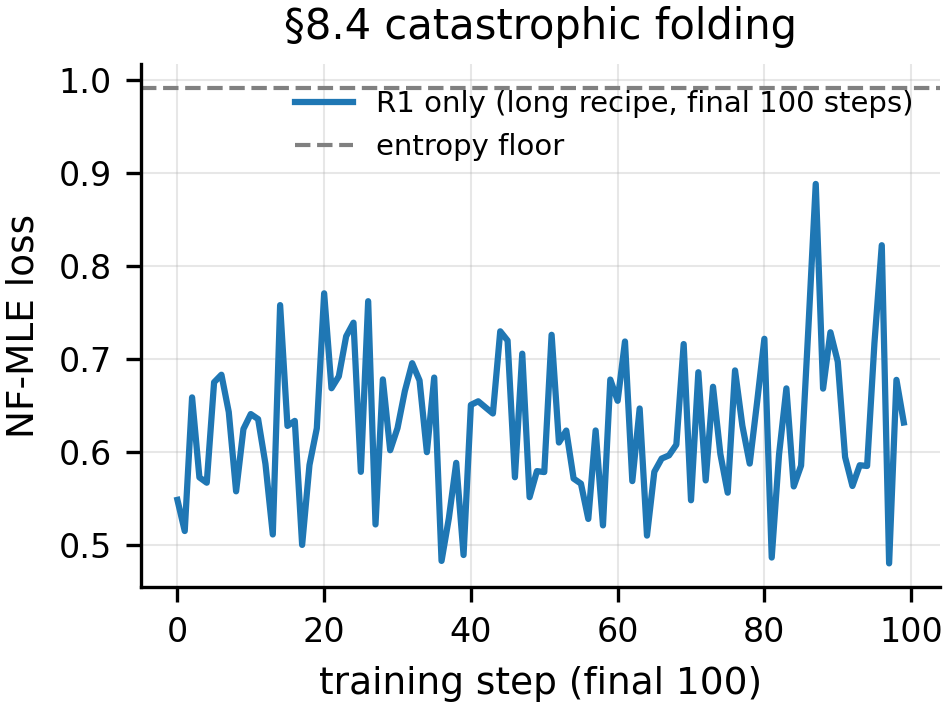

Source runs:
- `outputs/figure_data/8_4_folding`

## 8.5

### e10_per_experiment_boxplots — Per-experiment coverage_error_max boxplots (seeds × budgets)

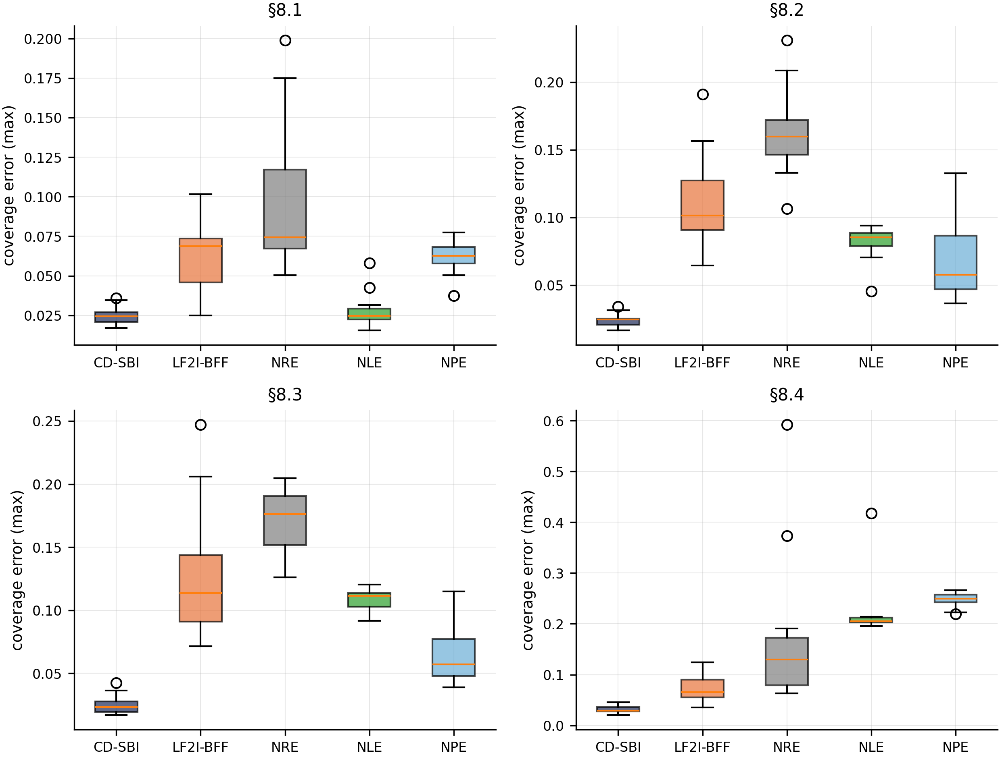

Source runs:
- `outputs/8_1_baseline_sweep`
- `outputs/8_2_baseline_sweep`
- `outputs/8_3_baseline_sweep`
- `outputs/8_4_baseline_sweep`

### e8_headline_summary — Cross-method coverage_error_max (log-y) across §8.1-§8.4

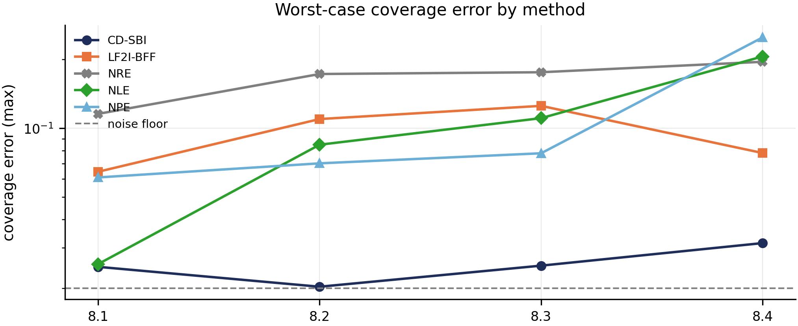

Source runs:
- `outputs/8_1_baseline_sweep`
- `outputs/8_2_baseline_sweep`
- `outputs/8_3_baseline_sweep`
- `outputs/8_4_baseline_sweep`

### e9_budget_saturation — §8.2 coverage_error_max vs parameter budget, per method

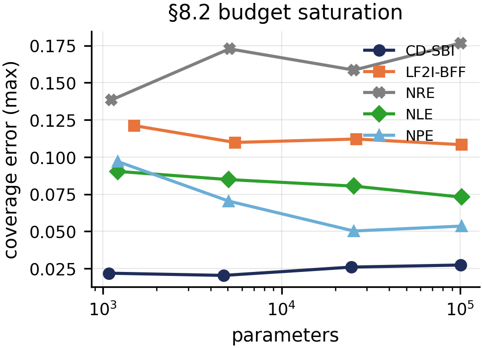

Source runs:
- `outputs/8_2_baseline_sweep`

## infra

### _hello — Hello-world synthetic figure (F0 pipeline smoke)

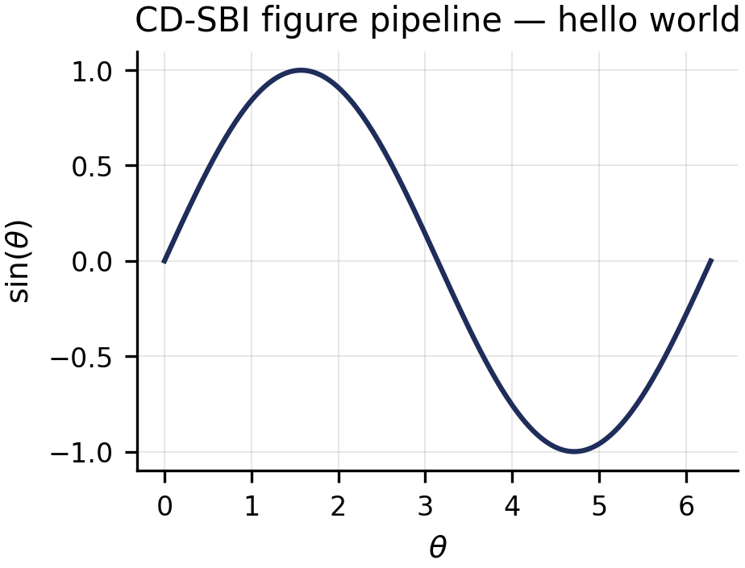
